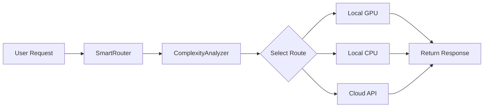

# Ollama Smart Router 🧠⚡

Enrutador de Modelos Inteligente - Selecciona automáticamente la mejor ruta de inferencia según la complejidad de la tarea.

Deja que los modelos pequeños locales manejen tareas simples, y cambia automáticamente a modelos grandes o APIs en la nube para tareas complejas, ahorrando tiempo y costos.

**[简体中文](README.md) | [English](README_EN.md) | [繁體中文](README_TW.md) | [日本語](README_JP.md) | [한국어](README_KR.md) | Español**

---

## 🌐 Visión general del proyecto

Ollama Smart Router es un enrutador de inferencia inteligente que analiza automáticamente la complejidad de cada solicitud y la dirige al modelo más adecuado entre GPU local, CPU local o API en la nube. Su objetivo es equilibrar velocidad, costo y calidad de respuesta, aprovechando al máximo los recursos disponibles en tu equipo sin renunciar a modelos potentes en la nube cuando la tarea lo requiere.



El diagrama muestra el flujo principal: cada solicitud pasa por el `SmartRouter`, que usa el `ComplexityAnalyzer` para decidir si se resuelve con un modelo local en GPU, un modelo local en CPU o una API en la nube, y finalmente se devuelve la respuesta al usuario.

---

## 📋 Tabla de contenidos

- [Requisitos](#requisitos)
- [Inicio rápido (5 minutos)](#inicio-rápido-5-minutos)
- [Pasos de instalación](#pasos-de-instalación)
- [Uso](#uso)
- [Preguntas frecuentes](#preguntas-frecuentes)
- [Contacto](#contacto)

---

## Requisitos

### ✅ Requisitos obligatorios

| Elemento | Requisito | Método de verificación |
|------|------|----------|
| **Sistema operativo** | Windows 10+/macOS/Linux | - |
| **Python** | 3.9 o superior | `python --version` |
| **Ollama** | Instalado y en ejecución | Icono de llama en la barra de tareas |
| **Memoria** | Al menos 8GB (recomendado 16GB) | - |
| **Red** | Acceso a GitHub y PyPI | El navegador puede abrir github.com |

### ⚠️ Requisitos opcionales (funciones más potentes)

| Elemento | Descripción |
|------|------|
| **Tarjeta gráfica NVIDIA** | Con GPU se acelera la inferencia de modelos pequeños |
| **Clave API en la nube** | DeepSeek/OpenAI, etc., para tareas complejas |

---

## Inicio rápido (5 minutos)

### Paso 1: Verificar entorno (30 segundos)

Abre una terminal/PowerShell y ejecuta:

```bash
# Windows
python --version
# Debería mostrar Python 3.9.x o superior

# macOS/Linux
python3 --version
```

### Paso 2: Descargar el proyecto (1 minuto)

**Método A: con git**
```bash
git clone https://github.com/tu-usuario/ollama-smart-router.git
cd ollama-smart-router
```

**Método B: sin git**
1. Haz clic en el botón verde `<> Code` → `Download ZIP`
2. Extrae el ZIP en cualquier carpeta
3. Entra en la carpeta extraída

### Paso 3: Instalación en un clic (2 minutos)

**Windows:**
```powershell
# En PowerShell
python check_env.py      # Verificar entorno
python install.py        # Instalación automática
```

**Mac/Linux:**
```bash
python3 check_env.py     # Verificar entorno
python3 install.py       # Instalación automática
```

### Paso 4: Ejecutar prueba (1 minuto)

```bash
# Verificar estado del hardware
python -m src --status

# Prueba simple
python -m src "Hola, preséntate"
```

🎉 **¡Felicidades!** Si ves una respuesta, la instalación fue exitosa.

---

## Pasos de instalación (detallados)

### 1. Instalar Python

**Verificar si ya está instalado:**
```bash
python --version      # Windows
python3 --version     # Mac/Linux
```

**Si no está instalado:**
- Windows/Mac: descarga e instala desde [python.org/downloads](https://python.org/downloads)
- **Importante**: durante la instalación marca `Add Python to PATH`

### 2. Instalar Ollama

1. Visita [ollama.com](https://ollama.com)
2. Descarga el instalador para tu sistema
3. Ejecuta Ollama tras instalar (aparecerá el icono de llama en la barra de tareas)
4. Descarga al menos un modelo:
   ```bash
   ollama pull gemma3:4b    # Modelo pequeño, obligatorio
   ollama pull qwen2.5:7b   # Modelo mediano, recomendado
   ```

### 3. Instalar este proyecto

```bash
# Descargar el proyecto
git clone https://github.com/tu-usuario/ollama-smart-router.git
cd ollama-smart-router

# Instalar dependencias
pip install -r requirements.txt

# Verificar la instalación
python check_env.py
```

---

## Uso

### Línea de comandos (recomendado para principiantes)

```bash
# Enrutamiento automático (lo más simple)
python -m src "Escribe un quicksort en Python"

# Modo interactivo (conversación tipo ChatGPT)
python -m src -i

# Forzar uso de GPU
python -m src "pregunta" --strategy gpu

# Forzar uso de la nube (requiere configurar clave API)
python -m src "pregunta compleja" --strategy cloud

# Ver estado del hardware
python -m src --status

# Listar modelos disponibles
python -m src --list-models
```

### Uso en código Python

```python
from src.router import SmartRouter

# Crear el router
router = SmartRouter()

# Enrutamiento automático
result = router.route("Escribe un quicksort en Python")
print(result.content)

# Ver qué ruta se usó
print(f"Ruta usada: {result.source}")  # local_gpu / local_cpu / cloud
print(f"Latencia: {result.latency:.2f} segundos")
```

### Configurar API en la nube (opcional)

**Método 1: Variable de entorno (recomendado)**
```bash
# Windows PowerShell
$env:DEEPSEEK_API_KEY="your-api-key-here"

# Mac/Linux
export DEEPSEEK_API_KEY="your-api-key-here"
```

**Método 2: Archivo de configuración**
Edita `config.yaml`:
```yaml
cloud:
  api_key: "your-api-key-here"
  base_url: "https://api.deepseek.com"
  model: "deepseek-chat"
```

---

## ⚡ Funciones principales

| Característica | Descripción |
|------|------|
| 🎯 **Enrutamiento inteligente** | Analiza automáticamente la complejidad y elige GPU local/CPU/nube |
| 🎮 **Protección de VRAM** | Monitorea la VRAM de la GPU en tiempo real para evitar fallos |
| 💻 **Degradación flexible** | Cambia automáticamente a inferencia en CPU si la GPU es insuficiente |
| ☁️ **Respaldo en la nube** | Cambia sin problemas a APIs como DeepSeek para tareas complejas |
| 📊 **Análisis de complejidad** | Identifica automáticamente tareas simples/medias/complejas |

### Lógica de decisión de enrutamiento

```
Tu entrada
      ↓
[Analizador de complejidad] juzga la dificultad
      ↓
┌─────────────────────────────────────┐
│ Simple + VRAM GPU suficiente → Modelo local pequeño  │
│ Simple + VRAM GPU escasa    → Modelo local pequeño  │
│ Media + VRAM GPU suficiente → Modelo local mediano  │
│ Media + VRAM GPU escasa    → Modelo local mediano  │
│ Compleja + API configurada → Modelo grande en la nube │
│ Compleja + sin API         → Modelo local grande    │
└─────────────────────────────────────┘
      ↓
   Devolver respuesta
```

---

## Preguntas frecuentes

### Q1: ¿Aparece `python` no es un comando interno?
**R:** Python no se añadió al PATH. Reinstala Python y **marca "Add Python to PATH"**.

### Q2: ¿Aparece fallo de conexión con `ollama`?
**R:** Asegúrate de que Ollama esté en ejecución:
- Windows: debe haber un icono de llama en la barra de tareas
- Prueba en línea de comandos: `ollama list` debería listar modelos

### Q3: ¿Aparece que el modelo no existe?
**R:** Descarga primero el modelo:
```bash
ollama pull gemma3:4b    # Obligatorio
ollama pull qwen2.5:7b   # Recomendado
```

### Q4: ¿Se puede usar sin GPU?
**R:** **¡Totalmente!** Sin GPU se usará automáticamente la CPU, solo será un poco más lento.

### Q5: ¿Cómo usar solo CPU?
**R:**
```bash
python -m src "pregunta" --strategy cpu
```

### Q6: ¿Cómo abrir terminal en Windows?
**R:**
1. En un área vacía de la carpeta del proyecto, mantén `Shift` + clic derecho
2. Selecciona "Abrir ventana de PowerShell aquí" o "Terminal"

---

## 📁 Estructura del proyecto

```
ollama-smart-router/
├── src/                      # Código fuente
│   ├── router.py            # Núcleo de enrutamiento inteligente
│   ├── gpu_monitor.py       # Monitoreo de GPU/CPU
│   ├── complexity_analyzer.py # Análisis de complejidad
│   └── cli.py               # Interfaz de línea de comandos
├── examples/                 # Ejemplos de uso
├── check_env.py             # Herramienta de verificación de entorno ⭐
├── install.py               # Script de instalación en un clic ⭐
├── config.yaml              # Archivo de configuración
├── requirements.txt         # Lista de dependencias
├── README.md                # Documentación en chino simplificado
├── README_EN.md             # Documentación en inglés
├── README_TW.md             # Documentación en chino tradicional
├── README_JP.md             # Documentación en japonés
├── README_KR.md             # Documentación en coreano
└── README_ES.md             # Documentación en español (este archivo)
```

---

## 🛠️ Configuración avanzada

### Modificar modelos predeterminados

Edita `config.yaml`:
```yaml
models:
  small: { name: "gemma3:4b" }    # Tareas simples
  medium: { name: "qwen2.5:7b" }   # Tareas medias
  large: { name: "llama3.2:8b" }   # Tareas complejas
```

### Ajustar umbral de VRAM

```yaml
gpu_thresholds:
  min_free_vram_gb: 4.0    # Por debajo de esto cambia a CPU
  safety_margin_gb: 1.0    # Margen de seguridad
```

---

## 🤝 Contribuir

¡Se aceptan Issues y PRs!

---

## 📞 Contacto del autor


**Escanea el QR de WeChat para consultar sobre el proyecto o sugerir mejoras**

> Nota al agregar amigo: **ollama-smart-router**

---

## 📜 Licencia

MIT License
